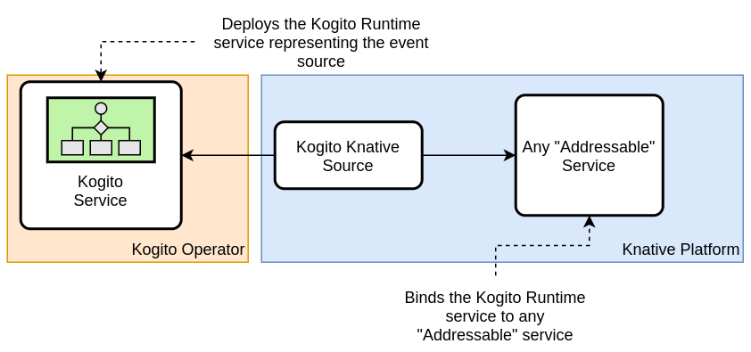

# Knative Eventing Kogito Source

[](https://godoc.org/knative-sandbox/eventing-kogito)
[](https://goreportcard.com/report/knative-sandbox/eventing-kogito)

Knative Source `eventing-kogito` is a source of CloudEvents provided
by [Kogito services](https://docs.jboss.org/kogito/release/latest/html_single/#con-kogito-automation_kogito-docs). Any
kind of Kogito service (rules, decisions, processes or serverless workflows) can produce events to the Knative Eventing platform. Please
visit [the Kogito documentation](https://docs.jboss.org/kogito/release/latest/html_single/#proc-knative-eventing-process-services_kogito-developing-process-services)
to understand how to create a Kogito application able to produce CloudEvents.

To learn more about Knative, please visit the
[Knative docs](https://github.com/knative/docs) repository.

If you are interested in contributing, see [CONTRIBUTING.md](./CONTRIBUTING.md)
and [DEVELOPMENT.md](./DEVELOPMENT.md).

## Getting Started

The Knative Eventing Kogito Source is an implementation of
the [Kogito Runtime](https://docs.jboss.org/kogito/release/latest/html_single/#proc-kogito-deploying-on-kubernetes_kogito-deploying-on-openshift)
custom resource managed by the [Kogito Operator](https://github.com/kiegroup/kogito-operator). You can deploy this
source the same way you would deploy any Kogito service. 

The figure below illustrates the deployment architecture of the Kogito Source:



The Kogito Source will bind the deployed Kogito Runtime service to
any [addressable](https://github.com/knative/specs/blob/main/specs/eventing/interfaces.md#addressable) resource in your
cluster. All the CloudEvents produced by the Kogito service will sink to the specified destination.

> Please note that the Kogito Source is under active development. The images and CRDs are **not** final and can be changed any time.

### Prerequisites

Before installing the Knative Eventing Kogito Source, you must meet the following prerequisites:

1. You have [installed Knative](https://knative.dev/docs/install/) Eventing and Serving (or
   have [OpenShift Serverless Platform](https://www.openshift.com/learn/topics/serverless) available)
2. You have [installed the Kogito Operator](https://github.com/kiegroup/kogito-operator)

### Deploying the Kogito Source

You will need administrative privileges in your cluster to install all the required resources.

By running the following command you will create the namespace `knative-kogito` in your cluster and all the resources
necessary to run the Kogito Source:

```shell
kubectl apply -f https://github.com/knative-sandbox/eventing-kogito/blob/main/kogito-source.yaml
```

Check if everything is running with:

```shell
kubectl get pods -n knative-kogito

NAME                                        READY   STATUS    RESTARTS   AGE
kogito-source-controller-7689d9dc6d-4l5hv   2/2     Running   1          86m
kogito-source-webhook-54b7c87ff9-5r46h      1/1     Running   0          127m
```

Now you can start deploying the [examples](./examples)!

## Roadmap

To learn more about future features, check our [Roadmap](ROADMAP.md).
