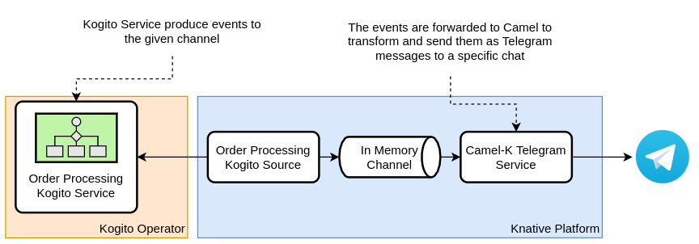
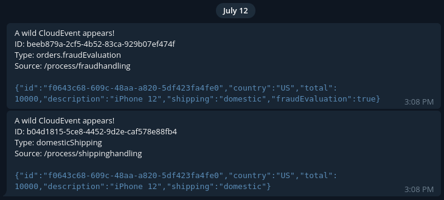

# Camel-K Telegram Notification Example

In this example you will deploy a Camel-K Service to deliver the Kogito Source Events to a Telegram chat. This is how it
works in the cluster:



## Prerequisites

Before starting, make sure that you have installed the prereqs defined in the [main README](../../README.md), and then:

1. [Install Camel-K](https://camel.apache.org/camel-k/latest/installation/installation.html) in your cluster
2. [Create a bot and grab an API Token](https://core.telegram.org/bots#3-how-do-i-create-a-bot) from the
   Telegram [Bot Father](https://telegram.me/botfather)
3. Start a conversation with your bot and go to [this website](https://codesandbox.io/s/get-telegram-chat-id-q3qkk) and
   grab the chat id

## Testing the Camel Route locally

To make things easier for you, in this directory you will find a Quarkus Camel project that you can run locally in order
to test the route before deploying it on
Kubernetes. [Follow the instructions in the project's README file](quarkus/README.md) to learn how to run it locally.

## Deploying on Kubernetes

The first thing you will deploy is the Kogito Source to produce events to your Telegram chat. You can use
the [Order Processing example](../order-processing-workflow.yaml):

```shell
REPO=https://github.com/knative-sandbox/eventing-kogito/blob/main/examples

kubectl apply -f ${REPO}/sinks/inmemory-channel.yaml
kubectl apply -f ${REPO}/order-processing-workflow.yaml
```

To check if everything is running, run:

```shell
kubectl get kogitosource
NAME                      READY   REASON   SINK                                                        AGE
kogito-order-processing   True             http://kogito-channel-kn-channel.kogito.svc.cluster.local   140m
```

Then you can deploy the Camel-K integration with:

```shell
AUTH_TOKEN=<grab one from the bot father>
CHAT_ID=<your chat ID>
REPO=https://github.com/knative-sandbox/eventing-kogito/blob/main/examples

kamel run \
      ${REPO}/camel-telegram/TelegramCloudEventNotification.java \
      --resource ${REPO}/camel-telegram/quarkus/src/main/resources/templates/TelegramMessage.tm \
      --name telegram-notification \
      --property authorizationToken=${AUTH_TOKEN} \
      --property defaultChatId=${CHAT_ID}
```

If you are on minikube, you can expose the Kogito Service deployed by the Knative Source to send CloudEvents messages
directly to it with:

```shell
kubectl expose deployment ks-kogito-order-processing --type=NodePort --port=8080 --name=order-service-exposed
```

Grab the URL with:

```shell
minikube service order-service-exposed --url
```

Send an Order event like this:

```json
{
  "id": "f0643c68-609c-48aa-a820-5df423fa4fe0",
  "country": "US",
  "total": 10000,
  "description": "iPhone 12"
}
```

You should see the messages in your phone:



Take a look at the
original [Order Processing project](https://github.com/kiegroup/kogito-examples/tree/stable/serverless-workflow-order-processing)
for more examples.
